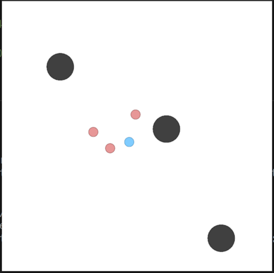

# Independent Deep Deterministic Policy Gradient Reinforcement Learning in Cooperative Multiagent Pursuit Games

This is the code for the paper 'Independent Deep Deterministic Policy Gradient Reinforcement Learning in Cooperative Multiagent Pursuit Games'.

## Instruction 

We have made some improvements and optimizations on the basis of [Igasil](https://raw.githubusercontent.com/tjuHaoXiaotian/GASIL).
In the scene, a more difficult "predator-prey" scene is added. Only by catching the prey together can the predator get the reward.
The PGDDPG method we proposed is added to the `algorithm`. Futhermore, Some data processing tools are added;

*Add control parameter to set whether to use reward shaping

*Add the parameter to set the proportion of reward shaping

*Increase the parameter of setting the number of obstacles

*Add the parameters of the test winning module
...

## Code Structure

"algorithm" Algorithm module

"env" Experimental environment

"result" Our training data

"tools" are some data display tools, which we used in our experiments

`run_ma_ddpg.py`: run ddpg\maddpg

`run_pgddpg_0.5`: bate = 0.5

`run_pgddpg_dec.py`: Bate decrement

`run_pgddpg_vs_fixp.py`: Training with regular opponents

`show.py`: Show a render of training

`test_ones.py`: Test the success rate against one prey model

`test_success_rate_all.py`: Test the success rate of all models against multiple prey models

## Have a try

You can run `run_ma_ddpg.py` , `run_pgddpg_0.5`,`run_pgddpg_dec.py` or `run_pgddpg_vs_fixp.py` , which preset the parameters,directly. Or you can modify the parameter settings as needed in `run_XXXXX.py`.

Note that if you want to test your model, you can set `render` to `true`， `train_prey`and `learning` to `false`.

## Experiments and results

The MPE environment with 3 obstacles.

The number of successful capture (cooperation) for algorithms over 2,000 steps.

In the predator-prey game with MPE,
a personal reward of +1 is given even if only one agent catches the prey (an intermediate event before the final state). The dashed lines correspond to the average rewards for the DDPG and MADDPG with personal rewards. The solid lines correspond to the
rates of successful capture for the DDPG and MADDPG with personal rewards.

The rates of successful capture for the PGDDPG (β = 0.8), DDPG(α = 1), and MADDPG (α = 5) in the predator-prey game with MPE. Each algorithm was individually trained on all ten prey. To clearly show the differences between different algorithms, we use different colours to represent different algorithms. The solid
line represents the mean, while the shadow represents the variance.

The rates of successful capture for each algorithm when trained with 10 different seeds in the predator-prey game with MPE. The red curves correspond to the PGDDPG (β = 0.8), the green curves correspond to MADDPG (α = 5), and the blue curves correspond to DDPG (α = 1).

 
